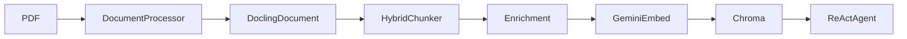
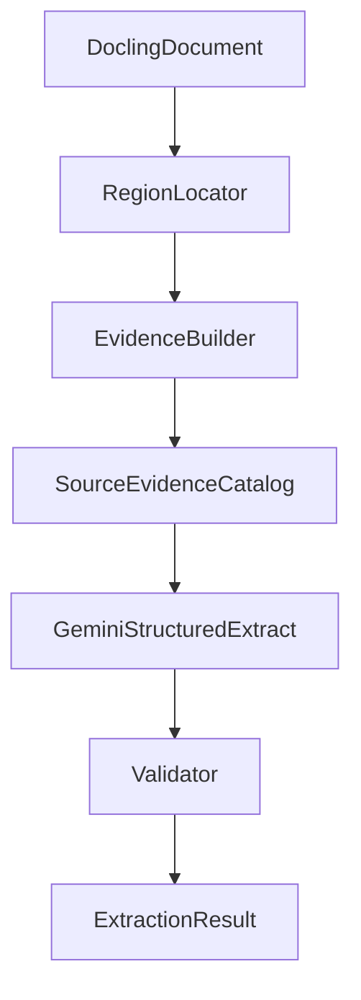

# Submittal Log Extraction — Implementation Plan

## Locked design decisions (from review)

1. **Evidence IDs** are derived from `docling_ref` + `text_hash` (content-addressed). Sequential ids like `ev_0001` are not used.
2. **`source_clause`** is optional. Only set when Docling markers/reading order yield a confident clause; otherwise `None` — never synthesized.
3. **Product candidates** use a pluggable strategy. `Part2ProductCandidateStrategy` is the 15891 prototype only, not a universal CSI assumption.
4. **Link `source_phrase` validation** uses normalized text matching (case/whitespace/hyphenation tolerant), not exact raw substring.

---

## Current architecture (what stays frozen)

Working RAG path (leave semantics and call sites unchanged):



| File | Role today | Submittal work |
|------|------------|----------------|
| [`src/document_processing.py`](src/document_processing.py) | PDF → native `DoclingDocument` | **Reuse** `DocumentProcessor` / its return dict shape; do not change converter options for RAG |
| [`src/vectorstore.py`](src/vectorstore.py) | HybridChunker ~700, enrichment, 768d embeddings, Chroma | **Untouched** |
| [`src/tools.py`](src/tools.py) / [`src/agent.py`](src/agent.py) | `search_documents` + ReAct chat | **Untouched** |
| [`app.py`](app.py) | Process & Index → Chat / Structure / Chunks | **Untouched** in prototype (no new tab yet) |
| [`src/structure_visualizer.py`](src/structure_visualizer.py) | Hierarchy / tables / bbox UI helpers | **Reuse patterns only** (prov/bbox/heading walks); do not overload it as the evidence store |
| [`verify_chunking.py`](verify_chunking.py) | Offline 15891 RAG regression + Docling cache | **Reuse load/cache pattern**; do not alter RAG tests |

Important gap: RAG chunk metadata stores `page` / `headings` / `raw_text` but **not** `self_ref` or bbox. Permanent evidence must be built by walking `DoclingDocument.texts` (and related items), not by reading Chroma chunks.

Docling already exposes what we need (confirmed in [`docling_output.json`](docling_output.json)): `self_ref` (e.g. `#/texts/17`), `prov[].page_no`, `prov[].bbox`, `orig`/`text`, `label`, markers like `1.` / `A.`.

---

## Target architecture (parallel path)



Chunks remain for Chat retrieval only. Submittal completeness uses the **full candidate region + product evidence catalog**, not top-k search.

---

## New files (minimal package)

Create package `src/submittal/` (keeps RAG modules clean):

| New file | Responsibility |
|----------|----------------|
| [`src/submittal/__init__.py`](src/submittal/__init__.py) | Package export of public pipeline entrypoint |
| [`src/submittal/models.py`](src/submittal/models.py) | Pydantic: `SourceEvidence`, `SubmittalRequirement`, `ProductGroup`, `Product`, `RequirementProductLink`, plus envelope `SubmittalExtractionResult` (lists only; no final register rows) |
| [`src/submittal/textnorm.py`](src/submittal/textnorm.py) | Shared `normalize_match_text` / hash-normalize helpers used by evidence IDs and phrase validation |
| [`src/submittal/evidence.py`](src/submittal/evidence.py) | Deterministic `SourceEvidence` from Docling elements; heading-path walker; `id` from `docling_ref` + `text_hash`; optional conservative `source_clause`; debug `chunk_id` left `None` |
| [`src/submittal/region.py`](src/submittal/region.py) | Locate complete submittal article (e.g. `1.04 SUPPLEMENTAL SUBMITTALS`) and collect contiguous body elements until next numbered article / PART boundary |
| [`src/submittal/product_candidates.py`](src/submittal/product_candidates.py) | Pluggable product-candidate strategies; **15891 prototype uses `Part2ProductCandidateStrategy`** (PART 2 headers + related body) — not a universal architectural assumption |
| [`src/submittal/extractor.py`](src/submittal/extractor.py) | Gemini 2.5 Flash structured call: prompt + evidence payloads → `SubmittalExtractionResult` via `ChatGoogleGenerativeAI.with_structured_output` (**separate** from [`src/agent.py`](src/agent.py)) |
| [`src/submittal/validate.py`](src/submittal/validate.py) | Reject unknown `evidence_ids`, dangling requirement/product IDs, and links that cite unsupported IDs; **normalized** `source_phrase` matching against cited evidence; ignore invented provenance fields |
| [`src/submittal/pipeline.py`](src/submittal/pipeline.py) | Orchestrate: locate region → build evidence → extract → validate → return result + rejection report |
| [`verify_submittals.py`](verify_submittals.py) | CLI harness for Section 15891 (mirrors [`verify_chunking.py`](verify_chunking.py) PDF discovery + `.cache_metal_ductwork.docling.json`); prints JSON; **no UI** |

No new persistence DB for the prototype: in-memory / CLI JSON output only.

---

## Step-by-step implementation

### Step 1 — Define Pydantic models

**Files:** create [`src/submittal/models.py`](src/submittal/models.py)

**Do:** Implement the five domain models exactly as specified, plus:

- `SubmittalExtractionResult` with `requirements`, `product_groups`, `products`, `links`
- Shared enums / literals for `mapping_method`, `review_status`, `evidence_kind`, `submittal_type`
- `SourceEvidence.chunk_id` and `contextualized_text` optional and documented as debug-only
- `SourceEvidence.source_clause` typed as `str | None` (optional; often `None`)
- LLM-facing schema that **omits** inventable provenance fields from the model’s write surface (LLM returns entity fields + `evidence_ids` only; app attaches real `SourceEvidence` records)

**Reuse:** nothing from RAG models (there are none).

**Untouched:** all existing `src/*` and `app.py`.

### Step 2 — Deterministic SourceEvidence from DoclingDocument

**Files:** create [`src/submittal/evidence.py`](src/submittal/evidence.py)

**How SourceEvidence is created (must be deterministic):**

1. Walk `doc.texts` in document order (same source of truth as Structure UI).
2. Maintain a rolling `heading_path` from `section_header` / title items (reuse the spirit of `_SECTION_HEADING_RE` from [`vectorstore.py`](src/vectorstore.py) **by copying a small local helper**, do not call into chunk enrichment).
3. For each body item in scope, build:

| Field | Source |
|-------|--------|
| `id` | Deterministic from `docling_ref` + `text_hash` (e.g. `ev_` + first 16 hex of SHA-256(`docling_ref + "\\0" + text_hash`)). Same parsed document → same IDs across re-runs. Never LLM-assigned; never sequential `ev_0001`. |
| `document_id` / `spec_section_id` | From caller (filename / `15891`) |
| `docling_ref` | `item.self_ref` |
| `page_number` | `item.prov[0].page_no` if present |
| `bbox` | `item.prov[0].bbox` → `{l,t,r,b,coord_origin}` if present |
| `raw_text` | Prefer `orig`, else `text` (exact Docling string) |
| `text_hash` | SHA-256 of a stable normalize-for-hash of `raw_text` (whitespace-collapsed; used for id stability) |
| `heading_path` | Rolling path at that item |
| `source_clause` | **Optional and conservative.** Set only when Docling markers + reading-order parents yield a high-confidence clause (e.g. clear `1.04` header + `A.` + `2.` stack). If ambiguous, incomplete, or reconstructed by guesswork → `None`. Do not synthesize `1.04.A.2`. |
| `evidence_kind` | Mapped from Docling `label` + region role (`submittal_requirement`, `product_header`, `product_body`, …) |
| `chunk_id` / `contextualized_text` | Leave unset in prototype |

**Reuse:** provenance/bbox access pattern from [`structure_visualizer.py`](src/structure_visualizer.py) `get_pictures_info` / hierarchy page reads.

**Must not:** invent text, pages, clauses, or refs; must not key permanence off HybridChunker `chunk_id` or sequential counters.

### Step 3 — Locate the complete submittal region

**Files:** create [`src/submittal/region.py`](src/submittal/region.py)

**Do:**

- Find header matching `1.04` + `SUBMITTAL` (configurable pattern; default tuned for 15891).
- Slice texts from that header inclusive until the next `^\d+\.\d+` article header or `PART \d` (for 15891: stop before `1.05 SUPPLEMENTAL QUALITY ASSURANCE`).
- Return the ordered Docling items + call `evidence.py` to emit the **complete** submittal `SourceEvidence` list.

**Test anchor already in repo:** chunks 3–6 in [`chunks_output.md`](chunks_output.md) show Product Data / Shop Drawings / Quality Control content under `1.04`; evidence must cover those Docling elements (`#/texts/15`…).

### Step 4 — Collect product / group candidate evidence (pluggable strategy)

**Files:** create [`src/submittal/product_candidates.py`](src/submittal/product_candidates.py)

**Architecture:** Treat product-candidate collection as a **strategy interface**, not a hard-coded CSI “PART 2” assumption.

```text
ProductCandidateStrategy.collect(doc, *, document_id, spec_section_id, submittal_evidence) -> list[SourceEvidence]
```

**15891 prototype strategy:** `Part2ProductCandidateStrategy`

- Without retrieval top-k, scan PART 2 section headers (e.g. `2.05 FACTORY-FABRICATED SINGLE WALL…`, `2.08 SOUND TRAPS…`) and include header + first-level descriptive / manufacturer list items.
- Also include product-mention items already present in the submittal-region evidence so explicitly named products can be linked.
- Wire this strategy as the default in `pipeline.py` for the 15891 CLI only.

**Long-term:** other strategies (keyword scan, named-product index, multi-section corpus) can replace or compose without rewriting the extractor/validator. Do not bake “PART 2 exists” into models or validation.

**Reuse:** same evidence builder; same Docling walk.

### Step 5 — Gemini structured extraction (separate from RAG agent)

**Files:** create [`src/submittal/extractor.py`](src/submittal/extractor.py)

**How it fits:**

- New LLM client: `ChatGoogleGenerativeAI(model=GEMINI_CHAT_MODEL or gemini-2.5-flash, temperature=0).with_structured_output(SubmittalExtractionResult)` — same API key / model env as [`src/agent.py`](src/agent.py), but **not** LangGraph / tools / MemorySaver.
- Prompt inputs:
  1. Full submittal-region evidence (id + heading_path + source_clause + raw_text + page)
  2. Product/group candidate evidence catalog (same fields)
  3. Hard rules: only cite supplied evidence IDs; do not invent source text / pages / clauses / docling refs; emit atomic requirements; emit groups/products; emit links with `mapping_method` + `source_phrase` taken from supplied text; set `review_required` when inferred.
- Do **not** call `search_documents` or Chroma for this completeness-sensitive step.

**Untouched:** [`src/agent.py`](src/agent.py), [`src/tools.py`](src/tools.py), embedding/Chroma path.

### Step 6 — Validation

**Files:** create [`src/submittal/validate.py`](src/submittal/validate.py)

**Rules:**

1. Build `allowed_ids = set(catalog.keys())`.
2. For every requirement / group / product / link: every `evidence_id` must be in `allowed_ids`; else **reject** entities with any unknown ID.
3. Links: `requirement_id` and `product_id` must exist in the returned (post-filter) sets; else reject link.
4. `source_phrase` checks use **normalized text matching**, not exact raw substring. Shared normalizer (same idea as evidence hashing): lowercase; collapse whitespace; strip punctuation noise; treat hyphen/space equivalently (`single-wall` ↔ `single wall`; OCR glue like `factoryfabricated` may also be handled by removing remaining separators). Accept the link when the normalized phrase is contained in the normalized text of at least one cited evidence item. If it does not match after normalization → reject the link (prototype default).
5. Never trust LLM-supplied page/docling_ref/raw_text if those fields appear — ignore them; only catalog evidence is authoritative.
6. Return `(cleaned_result, ValidationReport)` with counts of rejected items and reasons.

**Shared helper:** put `normalize_match_text(s) -> str` in a small util used by both `evidence.py` (for hashing input) and `validate.py` (for phrase checks), so ID stability and phrase validation stay consistent.

### Step 7 — Pipeline orchestration

**Files:** create [`src/submittal/pipeline.py`](src/submittal/pipeline.py)

```text
extract_submittal_log(
    docling_document,
    *,
    document_id,
    spec_section_id="15891",
    product_strategy=Part2ProductCandidateStrategy(),  # injectable
)
  → region items
  → submittal evidence
  → product candidate evidence (via strategy)
  → Gemini extract
  → validate (normalized phrase matching)
  → SubmittalPipelineResult(evidence_catalog, extraction, report)
```

**Reuse:** accepts an already-parsed `DoclingDocument` so CLI and (later) UI can share the session’s `docling_docs[].doc` without re-chunking.

### Step 8 — CLI test for Section 15891 (before any UI)

**Files:** create [`verify_submittals.py`](verify_submittals.py)

**Do:**

- Reuse PDF candidate list + `.cache_metal_ductwork.docling.json` load pattern from [`verify_chunking.py`](verify_chunking.py) (`DoclingDocument.model_validate`).
- Run pipeline; write `submittal_extraction_15891.json`.
- Print checklist assertions (soft pass/fail):
  - Presence of Product Data / Shop Drawings / Quality Control requirement clusters
  - Cross-ref mention of Section 15992 on QC leakage
  - Products/links mentioning factory-fabricated single-wall round ductwork, duct sealant, duct cement, gasket materials, duct liner, sound traps
  - Zero unknown evidence IDs in validated output
- Do not index Chroma; do not start Streamlit.

### Step 9 — (Later, out of prototype) UI packaging

Deferred: Streamlit tab, selecting products into final submittal-register rows. Not in this plan’s coding scope.

---

## Parts that must remain untouched

- Chunking, enrichment, embedding dimensionality, Chroma collection lifecycle
- `create_search_tool` / ReAct system prompt / chat streaming
- `Process & Index` success path semantics in [`app.py`](app.py)
- [`verify_chunking.py`](verify_chunking.py) RAG regression behavior
- No final “submittal register row” models or packaging logic yet

---

## Safest implementation order

1. Models only  
2. `textnorm.py` + evidence builder (content-addressed IDs; conservative `source_clause`) + smoke print from cached Docling JSON (no Gemini)  
3. Region locator for `1.04` (verify element count / text coverage against known 15891 content)  
4. Product candidate strategy interface + `Part2ProductCandidateStrategy`  
5. Validator with normalized phrase matching (fake LLM payloads)  
6. Gemini extractor + end-to-end `verify_submittals.py`  
7. Stop. UI / packaging only after you approve results on 15891  

---

## First coding step only (after you approve)

Create [`src/submittal/__init__.py`](src/submittal/__init__.py) and [`src/submittal/models.py`](src/submittal/models.py) with the five domain models + `SubmittalExtractionResult` / shared status enums — including optional `source_clause: str | None` and no sequential evidence-id helpers yet. **No Gemini calls, no Docling walking, no changes to existing RAG files.**
